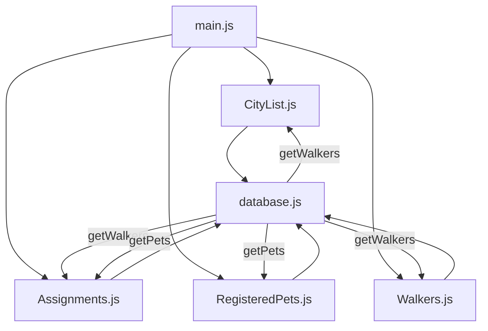

```mermaid
graph TD
    %% Main modules
    main[main.js] --> CityList[CityList.js]
    main --> Walkers[Walkers.js]
    main --> Assignments[Assignments.js]
    main --> RegisteredPets[RegisteredPets.js]

    %% Database module
    Assignments --> database[database.js]
    CityList --> database
    RegisteredPets --> database
    Walkers --> database

    %% Functions and data usage
    database -->|getWalkers| Assignments
    database -->|getPets| Assignments
    database -->|getWalkers| CityList
    database -->|getPets| RegisteredPets
    database -->|getWalkers| Walkers 
```